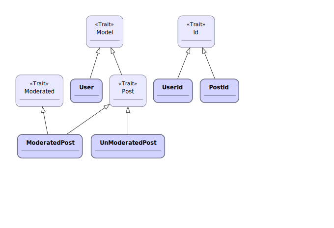
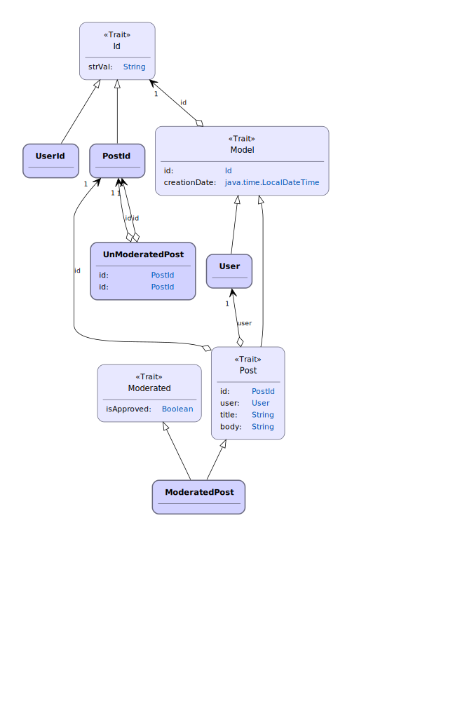

# scaldy
Generates a UML-ish class diagram (in [Graphviz](http://www.graphviz.org) dot format) from Scala sources.

The idea is to help auto-document a class model.
At the moment Scaldy generates boxes for classes and traits, and shows inheritance 
and composition relationships with arrows. Some details:

* Traits are stereotyped with «Trait» 
* Non-concrete boxes are labeled _in italics_
* Also concrete boxes have stronger colours
* Composition is based on class members
* At the moment only vars marked with @BeanProperty are processed
* The boxes are grouped and coloured by file
* At the moment Scaldy assumes that the first line in each file is a non-curly-braced package declaration and skips it because the parser has errors with that, so if your code is not shaped like this it won't work

There are sample model - diagram pairs below src/test/sample.

For example, if you are in sbt and run 

`> run C:\dev\scaldy\src\test\sample\posts`

it will scan .scala generate a scaldy.dot file there, then you can run

`C:\dev\scaldy>dot -Tsvg scaldy.dot -o ./src/test/sample/posts/diagram.svg`

to generate
 
 .

The result is a bit disconnected because there are no @BeanProperty annotations in this model. 
This is roughly the same class structure where some defs have been replaced by @BeanProperty var.
This sample is under /sample/beanposts/ and generates
 
 .